  
  
  
  

### `> whoami`

Soy **Luciano**, Software Engineer y Técnico Universitario en Desarrollo de Software (UPATecO), desde **Salta, Argentina**.
Hago productos de punta a punta: **webs y apps con React / Next.js**, **apps Android con Flutter** y **herramientas que automatizan trabajo** con Python y Node. También hago **QA automation con Playwright**.

- 🛠️ Ahora mismo: proyectos web para instituciones de Salta con Next.js + Supabase.
- 🎯 Me interesa: producto, UX y software que resuelva problemas locales reales.
- 🤝 Busco: puesto Full Stack / Frontend, remoto o presencial.

🇬🇧 Full-stack engineer from Argentina building web (React/Next.js), mobile (Flutter) and automation tools. Open to remote roles.

 

## 🕹️ Proyectos destacados

<table>
  <tr>
    <td width="50%" valign="top">
      
      
<a href="https://empleos-salta.vercel.app"><b>▶ Demo</b></a> · <a href="https://github.com/LucianoFlores1/empleos-salta">Código</a>

    </td>
    <td width="50%" valign="top">
      
      
<a href="https://tron-snake.vercel.app"><b>▶ Jugar</b></a> · <a href="https://github.com/LucianoFlores1/tron-snake">Código</a>

    </td>
  </tr>
  <tr>
    <td width="50%" valign="top">
      
      
<a href="https://github.com/LucianoFlores1/EasyTube"><b>Código</b></a>

    </td>
    <td width="50%" valign="top">
      
      
<a href="https://github.com/LucianoFlores1/control-remoto-pc-celular"><b>Código</b></a>

    </td>
  </tr>
  <tr>
    <td width="50%" valign="top">
      
      
<a href="https://github.com/LucianoFlores1/Precios-hist-ricos-de-steam"><b>Código</b></a>

    </td>
    <td width="50%" valign="top">
      
      
<a href="https://eduflow-argentina.vercel.app"><b>▶ Demo</b></a> · <a href="https://github.com/LucianoFlores1/eduflow-argentina">Código</a>

    </td>
  </tr>
</table>

<b>+ Más proyectos</b>

 

| Proyecto | Qué hace | Links |
|---|---|---|
| **CalculaHora** | Calcula cuánto cobrar por tramos de horas trabajadas en un día | [Demo](https://calcula-hora.vercel.app) · [Código](https://github.com/LucianoFlores1/CalculaHora) |
| **Fago Simulación** | Simulación animada de la reproducción de un bacteriófago y la lisis celular | [Demo](https://fago-simulacion.vercel.app) · [Código](https://github.com/LucianoFlores1/Fago-simulacion) |
| **Hackathon El Milagro** | Mini app para publicar animales perdidos y encontrados durante el Milagro en Salta | [Código](https://github.com/LucianoFlores1/hackathon-milagro) |
| **Quincho El Milagro** | Landing page para un negocio familiar | [Demo](https://quincho-el-milagro.vercel.app) · [Código](https://github.com/LucianoFlores1/quincho-el-milagro) |
| **Reproductor de música** | Reproductor de música para Android hecho en Flutter | [Código](https://github.com/LucianoFlores1/reproductor-musica) |
| **JSON Comparator** | Compara dos archivos JSON y devuelve los datos únicos de cada uno | [Código](https://github.com/LucianoFlores1/json-comparator) |
| **Drive Folder Scraper** | Extrae títulos, fechas e imágenes de una carpeta de Google Drive | [Código](https://github.com/LucianoFlores1/scrapt-folder-google-drive) |
| **Grok Image Generator** | Generador de imágenes con la API de Grok en Python | [Código](https://github.com/LucianoFlores1/grok-image-generator) |

## ⚙️ Stack

  
   
  

## 📊 Actividad

  
  

  <picture>
    <source media="(prefers-color-scheme: dark)" srcset="https://raw.githubusercontent.com/LucianoFlores1/LucianoFlores1/output/snake-dark.svg">
    <source media="(prefers-color-scheme: light)" srcset="https://raw.githubusercontent.com/LucianoFlores1/LucianoFlores1/output/snake-light.svg">
    
  </picture>

  <code>GAME OVER?</code> — nah. <a href="https://www.linkedin.com/in/lucrf/">Escribime por LinkedIn</a> y hablemos de tu próximo proyecto.

